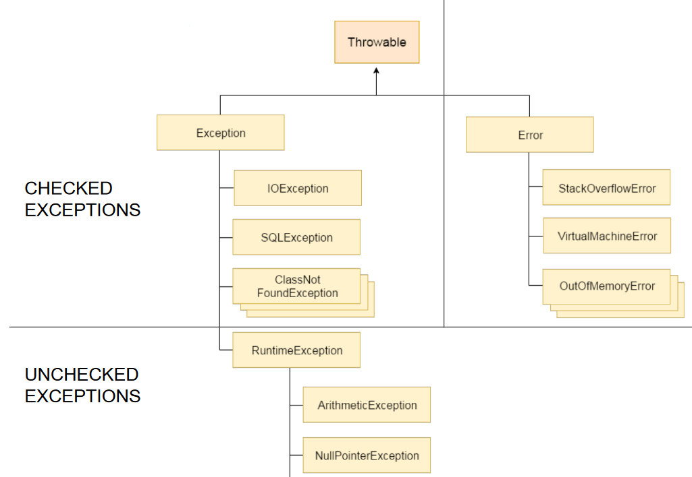

# Exceptions behandeln

Wie in der Problemstellung beschrieben kann man programmatisch Exceptions abfangen, aber was tut man dann, wenn man eine Exception abgefangen hat?

Die Ausnahmebehandlung verhindert, dass das Programm abstürzt, aber es ist dennoch meist wichtig folgendes im catch-Block zu tun, um den Fehler zu analysieren bzw. um Kunden nicht zu verärgern, ...:
- Benutzer\*in über den Fehler informieren (z.B. beim Login "*die eingegebenen Zugangsdaten sind ungültig*")
- Eintrag über den aufgetretenen Fehler in den Logfile erstellen (z.B. wenn ein falsches Passwort eingegeben wurde "*Für den\*die Benutzer\*in wurde ein falsches Passwort eingegeben*")
- gegebenenfalls angefangene Operationen rückgängig machen, welche die Integrität der Daten und/oder das Weiterlaufen des Programms verhindern.
- ...

## Welche Arten von Exceptions gibt es?

Exceptions sind hierarchisch aufgebaut. Wie im letzten Kapitel gelernt, können Klassen voneinander erben. Diese Möglichkeit machen sich Programmiersprachen auch in Bezug auf Fehler zunutze. So wie die Klasse Object die Basis aller Klassen ist, ist die **Klasse Exception** die Basis aller Exceptions bzw. die **Klasse Thowable** die Mutter aller Exceptions und Fehler (Error).

Hier eine Liste von häufig verwendeten Exceptions und deren Hierarchie:



In **Java** unterscheidet man zwischen **checked-** und **unchecked-Exceptions**. Der Sinn dahinter liegt darin, dass checked-Exceptions in der Signatur der Methode mit dem Schlüsselwort **throws** angegeben werden müssen. So ist dem\*der Anwender\*in der Methode bekannt, welche Art von Exceptions ausgeworfen werden kann.

Um eine ausführlichere Liste der in Java bereits implementierten Exceptions zu erhalten, schaue dir diesen Link an:

[Java Exception-Klasse](https://docs.oracle.com/javase/8/docs/api/java/lang/Exception.html)

## Woraus besteht eine Exception?

Eine Exception besteht in der Regel aus:
- einem Fehlertyp: der Objekttyp des Fehlers (z.B. SQLException, RuntimeException, IOException, ...)
- einer Fehlernachricht/-beschreibung: Die Message in der Exception
- einem sogenannte Stacktrace: die Hierarchie der Klassen, zwischen der Klasse, in der die Exception abgefangen wurde und der Klasse, in der der Fehler tatsächlich aufgetreten ist.
- gegebenenfalls aus einem Grund: Wenn einr Exception abgefangen wird, wird häufig eine andere Exception weitergereicht, um zum Beispiel aus einem sehr technischen Fehler, einen für den\*die Benutzer\*in verständlichen Fehler auszuwerfen. In dieser weitergereichten Exception kann man die ursprüngliche Exception als Grund (cause) weiterreichen.

## Wie fängt man Exceptions ab?

In den meisten Programmiersprachen spricht man von einem **try-catch-finally**-Block, also versuche mal diesen Code und wenn ein Fehler auftritt, fange ihn auf und führe den folgenden Code aus.

### Java

```java
try {
  System.out.println("probiere mal dies.");
  [...]
} catch (SQLException e) {
  e.printStackTrace();
  System.out.println("Es ist etwas schief gelaufen, das mit SQL zu tun hat!");
} catch (Exception e) {
  System.out.println("Es ist etwas Anderes schief gelaufen!");
  System.out.println(e.getMessage());
  e.printStackTrace();
} finally {
  System.out.println("Mach das auf jeden Fall!");
}
```

Alle Code-Zeilen im **try**-Block sind vor Exceptions geschützt, aber vor welchen Exceptions?

Das hängt davon ab, was im **catch** deklariert wurde. 

Mit **catch(Exception e)** wird sichergestellt, dass alle Exceptions durch diesen **catch**-Block abgefangen werden.

Allerdings kann man auch granularer arbeiten und eine spezielle Behandlung für z.B. **SQLException** definieren. 

**catch**-Blöcke kann man mehrere definieren, wenn man je Exceptiontyp unterschiedliche Behandlung vorsieht. Diese stellt man einfach untereinander und sie werden in der Reihenfolge abgehandelt, wie sie vorkommen. Wird ein **catch**-Block ausgeführt, werden die weiteren ausgelassen. 

Nehmen wir ein Beispiel: Wir wollen **ArithmeticException**, **RuntimeException** und **Exception** abfangen. Diese müssen in dieser Reihenfolge abgefangen, da ArithmeticException von RuntimeException erbt und RuntimeException erbt natürlich von Exception.

Im **finally**-Block schreibt man einen Code, der in jedem Falle ausgeführt werden muss, egal ob eine Exception abgefangen oder alles gut gelaufen ist.

## Wie analysiert man einen Stacktrace?

Der Stacktrace soll uns dabei helfen, herauszufinden, wo der Fehler aufgetreten ist.

Hier ein Beispiel aus einem Java-Programm:

```
Exception in thread "main" java.lang.NullPointerException
at com.codersbay.UserManager.findUser(UserManager.java:19)
at com.codersbay.Main.main(Main.java:7)
```

Man erkennt hier in der 1. Zeile, dass der Fehler vom Typ **java.lang.NullPointerException**. Das sagt schon mal aus, dass hier versucht wurde auf ein Attribute oder Methode eines Objekts, das noch nicht instanziert wurde (also den Wert null beinhaltet, deswegen null-Pointer).

In den Zeilen darunter sieht man alle Methoden, in denen der Fehler weitergereicht wurde. Hier fängt man von unten an zu lesen:
- der Fehler wurde als Letztes in der Methode **com.codersbay.Main.main** in der Datei **Main.java** Zeile 7 geworfen.
- dieser Fehler kommt von der Methode **com.codersbay.UserManager.findUser** in der Datei **UserManager.java** Zeile 19.
In dem Fall hört der Stacktrace hier auf. In anderen Fällen, kann dieser durchaus viele Zeilen aufweisen.

Um den ursprünglichen Fehler ausfindig zu machen, geht man den Stacktrace Zeile für Zeile durch. 

Sehr häufig findet man den Fehler irgendwo in der Nähe des Wechsels zwischen einer selbstprogrammierten Klasse/Methode und einer von Java bzw. von einem Framework bereitgestellten Klasse/Methode. 

[Zurück zur Startseite](README.md)